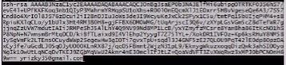
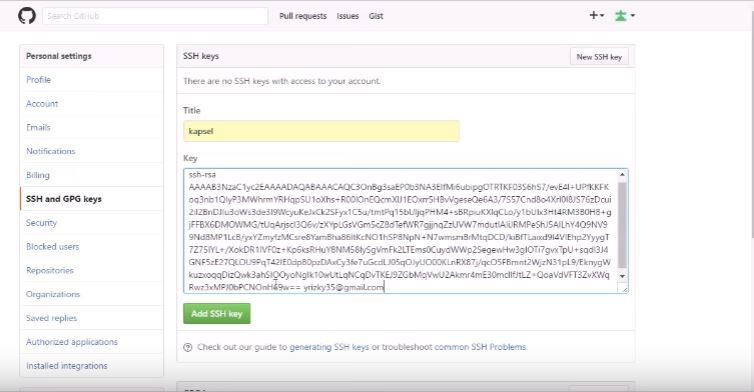
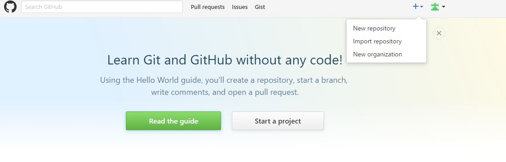
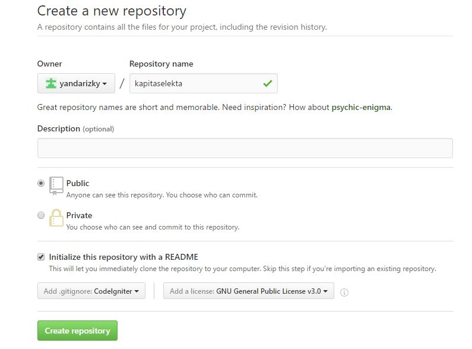
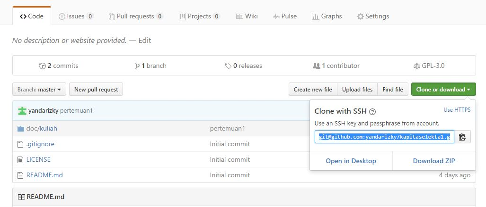

**RESUME PERTEMUAN 1 KAPITA SELEKTA**

  

**Latar Belakang Masalah**

1. Bagaimana tutorial penggunaan aplikasi git bash di windows dari mulai membuat repository,add ssh key,pull and push dengan menggunakan git bash?

**ISI**

Tutorial penggunaan Git bash pada windows add ssh key:

**1.** Pertama-tama klik pada profile kemudian pilih setting,pada menu personal setting pilih SSH dan GPG key.

**2.** Setelah itu pilih **new SSH key**

**3.** kemudian ada title yang harus diisi ,isi saja contoh nya yaitu &quot;kapsel&quot; untuk key kita bisa dapatkan dengan cara klik kanan open new tab pada **generating ssh key.**
Setelah sudah terbuka pilih **Generating**** A New SSH Key And Adding It To The SSH Agent.**

**4.** Setelah sudah terbuka selanjutnya yaitu copy **Codingan/Script ini** ssh-keygen -t rsa -b 4096 -C &quot;_your\_email@example.com_&quot;

**5.** Setelah itu buka aplikasi git bash nya lalu paste kan script tadi kedalam aplikasi Git bash lalu edit script bagian ini [_your\_email@example.com_](mailto:your_email@example.com) dengan menggantinya dengan email yang valid lalu enter.

**6.** Kemudian enter lagi setelah itu ketik &quot;y&quot; kemudian enter lagi.

**7.** Setelah itu masukkan passphrase dengan numeric yang panjang nya minimal 6 digit lalu enter.

**8.** Setelah itu masukkan ulang passphrase kemudian enter lagi.

**9.** Kemudian masukkan script ini **cat ~/.ssh/id\_rsa.pub** ,Script ini berfungsi untuk memunculkan ssh key yang kita buat kemudian enter.

**10.** Kemudian akan muncul ssh key yang telah kita buat,lalu copy ssh key tersebut dari mulai ssh-rsa hingga email yang kita buat tadi seperti gambar dibawah ini.

  

**11.** Setelah di copy lalu paste ssh key tersebut di textbox key yang masih kosong tadi kemudian klik **add SSH key.** SSH key sudah berhasil dibuat.

  

Yang selanjutnya yaitu tutorial mengenai pembuatan repository baru,push and pull Request:

**1.** Pertama-tama klik tanda plus yang terletak di sebelah profile lalu pilih new repository.

  

**2.** Kemudian buat repository baru dengan nama yang ingin dibuat,lalu ceklist checkbox ini **Initialize this repository with a README**  untuk **add .gitignore:** pilih sesuai kebutuhan jika disini dicontohkannya memilih CodeIgniter sedangkan untuk **add a license** pilih GNU General Public License v2.0 seperti gambar dibawah ini:

  

**3.** Setelah sudah diisi semua lalu klik **create repositrory.**

**4.** Setelah repository telah dibuat kemudian kita buka windows explorer.

**5.** Setelah windows explorer telah dibuka selanjutnya kita buat folder baru dengan nama yang sama dengan nama repository yang kita buat yaitu dengan nama **kapitaselekta.** folder ini berfungsi untuk sebagai wadah menghubungkan repository ke github.

**6.** Setelah itu buka folder **kapitaselekta** yang kita buat tadi kemudian klik kanan lalu pilih git bash here.

**7.** Setelah itu akan otomatis terbuka aplikasi git bash,kemudian tuliskan script **git init** kemudian enter.

**8.** Setelah itu tuliskan lagi script **get remote add origin** [**git@github.com:yandarizky/kapitaselekta1.git**](mailto:git@github.com:yandarizky/kapitaselekta1.git)setelah itu enter.
Link ini merupakan link dari ssh yang bisa didapatkan di github caranya yaitu seperti gambar dibawah ini:

  

**9.** Selanjutnya yaitu melakukan pull request yaitu untuk mengirim datadari github ke folder kapitaselekta yang kita buat di windows tadi dengan cara **git pull origin master** ,kemudian enter.

**10.** Setelah itu masukkan passphrase yang telah di buat pada awal tutorial di add ssh key tadi,setelah dimasukkan lalu enter.

**11.** Jika berhasil maka folder kosong yang telah kita buat tadi sudah terisi dengan data repository yang terdapat di github.

**12.** Jika ingin menambahkan data/file berarti kita akan melakukan push request.push request itu adalah menambahkan file dari folder yang ada di windows ke dalam guthub.

**13.** Cara melakukan push request adalah dengan cara buka kembali aplikasi git bash kemudian masukkan scrpt **git add doc/kuliah/pertemuan1.md**

Doc itu merupakan folder yang telah dibuat didalem folder kapita selekta,kuliah merupakan folder yang dibuat di dalam folder doc dan pertemuan1.md merupakan data yang akan ditambah ke github.untuk data yang ditambahkan harus berbentuk MD atay _MarkDown._

**14.** Setelah itu lakukan commit dengan masukkan script **git commit –m &quot;pertemuan1&quot;** lalu enter.

**15.** Setelah di commit lakukan push request dengan memasukkan script **git push origin master** lalu enter.

**16.** Setelah itu cek github untuk memastikan data tersebut sudah berhasil dimasukkan/ditambahkan.

## Kesimpulan
jadi dari penjelasan-penjelasan dan tutorial diatas maka dapat disimpulkan bahwa penggunaan git bash sangat mudah dan script-script yang digunakan mudah di mengerti dan di hafal.

## Saran
Saran dari saya yaitu agar terus menggunakan aplikasi git bash ini untuk mengembangkan beberapa project yang akan dibuat kedepannya.

link github: https://github.com/yandarizky/kapitaselekta

Nama : yanda rizky prasetiya

NPM : 1144004

Kelas : 3C

 

Prodi : D4 Teknik Informatika

Mata Kuliah : Kapita Selekta

link mata kuliah: www.awangga.net

referensi: https://youtu.be/qN1hS70Ebhw

Scan plagiarisme:
 

1. https://drive.google.com/open?id=0ByZqhNt9UFJ2YjVFVVRFQThvX2M 
 2. https://drive.google.com/open?id=0ByZqhNt9UFJ2MmlIWDBWZ2xuaDA